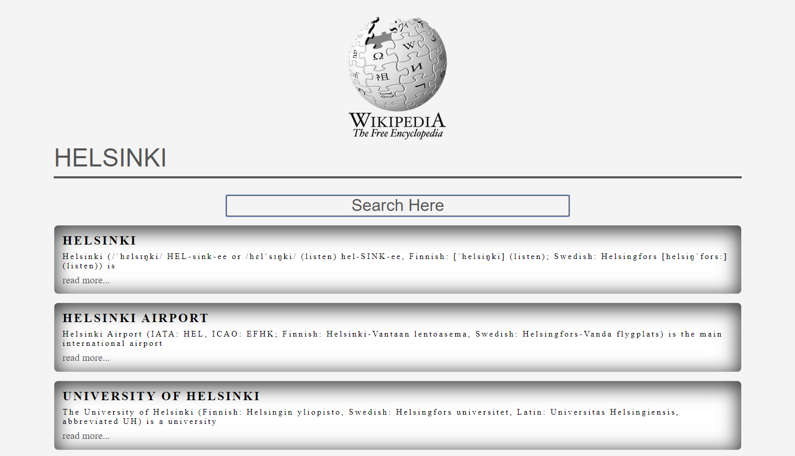

# Wiki Search

This app was created using JavaScript, CSS and HTML. The user can input a search value and the results will be dynamically displayed below the search button. The data is fetched using Wikipedia's free api.

# [Demo](https://my-wiki-search.netlify.com/)

# Preview

 

 # Technologies

 *Javascript
 *CSS
 *HTML

 # Author

 Simon Maher